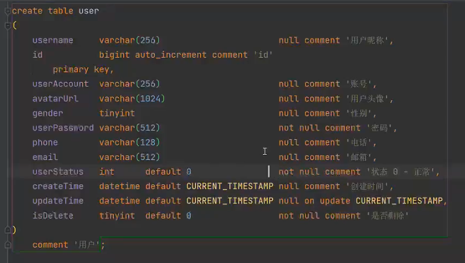
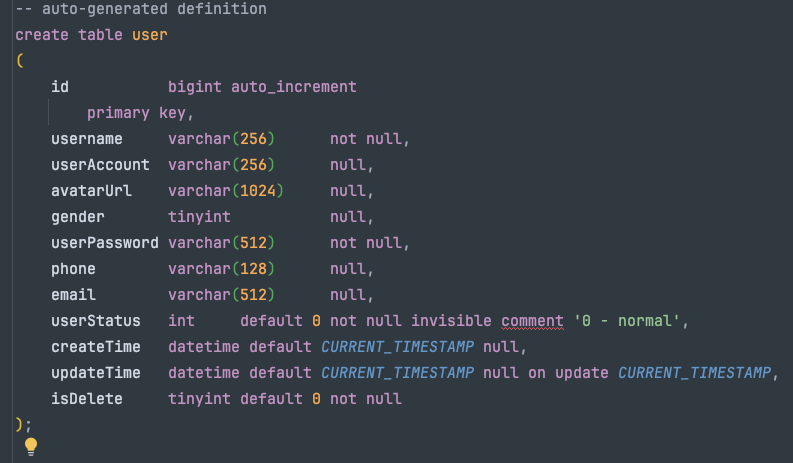

# Introduction

This is Backend App for user center.

# Stack

- Java
- Spring: Framework for dependencies insert, help to manage Java objects
- SpringMVC: Web Framework, provides API access, RESTful API
- MyBatis: Framework to help java operate database
- MyBatis-plus: MyBatis strengthen, no need SQL for CRUD
- SpringBoot: quick start (boot), don't need to manage spring dependencies/setup

# Setup

- initial spring project with Spring Initializer in IDEA
  - #what is Maven?
- How to use MyBatis-plus? [see documentation](https://baomidou.com/getting-started/install/) 
  - MyBatis-plus dependency
  - follow quick-start in documentation
  - what is Mapper?
    - for MyBatis you define the CRUD in mapper
- application.properties --> application.yml
  - .yml is eaiser to write when there are more layers
  - add config of data base
  - add port of this backend
  - add config of mabatis-plus
- 

# Database





- isDelete: logic delete, in the real-world company normally don't really delete user data, but just set to 0

## Create Table

1. using DDL
2. using right-click table --> new table

# Model <--> Database

- Layers: controller, service, utils, mapper, model

- connect database table to model objects and generate objects automatically

  - MyBatisX-Generator Plugin --> what will be generated?
    - domain (objects)
    - mapper (operate objects in database)
    - mapper.xml (connection between mapper objects and database, SQL operations here)
    - service (logical business, CRUD)
    - serviceImpl (implements service)

- let's test service: UserServiceTest

  - new User
  - setter, getter
  - test user.save( )
  - #got problem with lombok and solve and wrote here: https://www.codefather.cn/post/1864728138141466625 
  

# Service

## Registration

1. user register from frontend with userAccount, userPassword, checkPassword
2. check userAccount, userPassword, checkPassword
   1. not null
   2. account not shorter than 4 digits
   3. password not shorter than 8 digits
   4. unique account
   5. no special character in account
   6. userPassword and checkPassword are same
3. encrypt password!!!
4. save in database

## Login

1. check userAccount, userPassword --> same with registration 
   1. not null
   2. account not shorter than 4 digits
   3. password not shorter than 8 digits
   4. no special character in account
2. is userPassword correct? same with encryptPassword in database --> query in database
3. What is user is deleted logically?
4. hide sensitive information of user (password)
   1. return a new/safe user
   2. new user instance and set parameters
5. record session of user and store it in server (SpringBoot tomcat; frontend cookie)
   1. session (backend) and cookie (frontend)
   2. How to know which user login? 
6. return user without sensitive information

# Controller

- Provoide API to Frontend

- Communication between Frontend and Backend

  - user input their account, password from Frontend

  - these information will be packed into json file (common use)

  - json file will be passed to Backend

  - Backend will need json file to "connect" with objects in backend

  - for example: Login

    - user gives account and password

    - account and password will be packed in json file

      ```json
      {
        "userAccount": hurryclear,
        "userPassword": 111111111
      }
      ```

    - Backend connect this json file with `UserLoginRequest` through `@RequestBody` and translate json object to object in backend

  - Why do we need `UserLoginRequest` and `UserRegisterRequest`? And why implements with `Serializable`? #todo

- Java Interface and Class

  - we import UserService in Controller instead of UserServiceImp, why?#todo

- API test tool: generated-requests.http in IDEA

  - for example: login

  - ```http
    POST http://localhost:8080/api/user/login
    Content-Type: application/json
    
    {
      "userAccount":"hurryclear",
      "userPassword": 123456789
    }
    ```

    - suppose we got json file from Frontend: {...}
    - we pass it to Backend with .../user/login API
    - if it works good, will return User in json file

- 

## User Manage

- check role
  - two kinds for now
    - default: user --> 0
    - admin --> 1
  - "role" add into user table in database
    - int
    - default value: 0
  - "role" add into `User` Class
- search and delete
  - `@PostMapping("/search")` and `@PostMapping("/delete")`
  - using methods in `userService`, there are methods which are implemented from `IRepository` (MyBatis-plus)
- 
