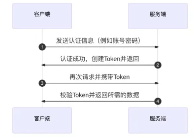

# Introduction

This is Backend App for user center.

# Stack

- Java
- Spring: Framework for dependencies insert, help to manage Java objects
- SpringMVC: Web Framework, provides API access, RESTful API
- MyBatis: Framework to help java operate database
- MyBatis-plus: MyBatis strengthen, no need SQL for CRUD
- SpringBoot: quick start (boot), don't need to manage spring dependencies/setup

# Setup

- initial spring project with Spring Initializer in IDEA
  - #what is Maven?
- How to use MyBatis-plus? [see documentation](https://baomidou.com/getting-started/install/) 
  - MyBatis-plus dependency
  - follow quick-start in documentation
  - what is Mapper?
    - for MyBatis you define the CRUD in mapper
- application.properties --> application.yml
  - .yml is eaiser to write when there are more layers
  - add config of data base
  - add port of this backend
  - add config of mabatis-plus
- 

# Database

```sql
-- auto-generated definition
create table user
(
    id           bigint auto_increment
        primary key,
    username     varchar(256)      null,
    userAccount  varchar(256)      null,
    avatarUrl    varchar(1024)     null,
    gender       tinyint           null,
    userPassword varchar(512)      not null,
    phone        varchar(128)      null,
    email        varchar(512)      null,
    userStatus   int     default 0 not null,
    createTime   datetime          null,
    updateTime   datetime          null,
    isDelete     tinyint default 0 not null,
    userRole     int     default 0 null
);
```

- isDelete: logic delete, in the real-world company normally don't really delete user data, but just set to 0

## Create Table

1. using DDL
2. using right-click table --> new table

# Model <--> Database

- Layers: controller, service, utils, mapper, model

- connect database table to model objects and generate objects automatically

  - MyBatisX-Generator Plugin --> what will be generated?
    - domain (objects)
    - mapper (operate objects in database)
    - mapper.xml (connection between mapper objects and database, SQL operations here)
    - service (logical business, CRUD)
    - serviceImpl (implements service)

- let's test service: UserServiceTest

  - new User
  - setter, getter
  - test user.save( )
  - #got problem with lombok and solve and wrote here: https://www.codefather.cn/post/1864728138141466625 
  

# Service

## Registration

1. user register from frontend with userAccount, userPassword, checkPassword, planetCode
2. check userAccount, userPassword, checkPassword, planetCode
   1. not null
   2. account not shorter than 4 digits
   3. password not shorter than 8 digits
   4. unique account, planet code
   5. no special character in account
   6. userPassword and checkPassword are same
3. encrypt password!!!
4. save in database

## Login

1. check userAccount, userPassword --> same with registration 
   1. not null
   2. account not shorter than 4 digits
   3. password not shorter than 8 digits
   4. no special character in account
2. is userPassword correct? same with encryptPassword in database --> query in database
3. What is user is deleted logically?
4. hide sensitive information of user (password)
   1. return a new/safe user
   2. new user instance and set parameters
5. record session of user and store it in server (SpringBoot tomcat; frontend cookie)
   1. session (backend) and cookie (frontend)
   2. How to know which user login? 
6. return user without sensitive information

# Controller

- Provoide API to Frontend

- Communication between Frontend and Backend

  - user input their account, password from Frontend

  - these information will be packed into json file (common use)

  - json file will be passed to Backend

  - Backend will need json file to "connect" with objects in backend

  - for example: Login

    - user gives account and password

    - account and password will be packed in json file

      ```json
      {
        "userAccount": hurryclear,
        "userPassword": 111111111
      }
      ```

    - Backend connect this json file with `UserLoginRequest` through `@RequestBody` and translate json object to object in backend

  - Why do we need `UserLoginRequest` and `UserRegisterRequest`? And why implements with `Serializable`? #todo

- Java Interface and Class

  - we import UserService in Controller instead of UserServiceImp, why?#todo

- API test tool: generated-requests.http in IDEA

  - for example: login

  - ```http
    POST http://localhost:8080/api/user/login
    Content-Type: application/json
    
    {
      "userAccount":"hurryclear",
      "userPassword": 123456789
    }
    ```

    - suppose we got json file from Frontend: {...}
    - we pass it to Backend with .../user/login API
    - if it works good, will return User in json file

- 

## User Manage

- check role
  - two kinds for now
    - default: user --> 0
    - admin --> 1
  - "role" add into user table in database
    - int
    - default value: 0
  - "role" add into `User` Class
- search and delete
  - `@PostMapping("/search")` and `@PostMapping("/delete")`
  - using methods in `userService`, there are methods which are implemented from `IRepository` (MyBatis-plus)

## Login-state

https://blog.csdn.net/LAM1006_csdn/article/details/120440394

https://www.cnblogs.com/88223100/p/One-article-to-understand-the-common-login-schemes-of-the-front-and-rear-end.html

### Login state/authentication state/登录态

- the system will remember you after your login, so that the users don't can switch between different pages

### Session-based login state


- session: server create and manage
- cookie: client (browser) manage and store
- Steps:
  - After logging in, the server saves user information in a **session**.
  - A session ID is sent to the client as a **cookie**.
  - When the client sends the session ID with each request, the server knows which user is logged in.
- Cons: server needs storage for session

### Token-based login state



- Traditional token
  - The server generates a **token** (JWT) after login and sends it to the client.
  - The client must include this token in the Authorization header for future requests.
  - server validates the token without storing session data (stateless).
  - 
  - everytime has to query databse to know the validity of the token --> consums the performance
- JWT
  - Json Web Token
  - 3 parts
    - header
    - payload
    - signature
    - 
  - 

## get current user

```java
@GetMapping("/current")
public User getCurrentUser(HttpServletRequest request) {
  Object userObj = request.getSession().getAttribute(USER_LOGIN_STATE);
  User currentUser = (User) userObj;
  if (currentUser == null) {
    return null;
  }
  long userId = currentUser.getId();
  User user = userService.getById(userId);
  return userService.getSafetyUser(user);
}
```

## Logout

- Backend: remove user attribute which saved in session when user login
- Frontend: 

# Communication between Backend and Frontend


## Proxy

- forward proxy and reverse proxy

- Nginx server or Node.js server

- Ant Design Pro has `proxy.ts` for us to set proxy (forward proxy)

  ```typescript
  // localhost:8000/api/** -> https://preview.pro.ant.design/api/**
      '/api': {
        // 要代理的地址
        target: 'http://localhost:8080/',
        // 配置了这个可以从 http 代理到 https
        // 依赖 origin 的功能可能需要这个，比如 cookie
        changeOrigin: true,
      },
  ```

- 

# Backend Optimization

## 通用返回对象

- http also has state code, but that's not accurate enough
- we can define our own state code which returns to frontend, so frontend can know the state in details

```json
{
  "name":
}
  
{
  "code": 00 // state code
  "data": {
	  "name": 
	},
	"message": "ok"
}
```

## 封装全局异常处理


## 全局请求日志和登录校验

# Frontend Optimization


# Frontend

- using Ant Design Pro as the framework and adjust the code accordingly
- 

## ProComponents

### Pro Table

- https://procomponents.ant.design/en-US/components/table?tab=api&current=1&pageSize=5
- Find the component you need, copy the src code and add into your code

